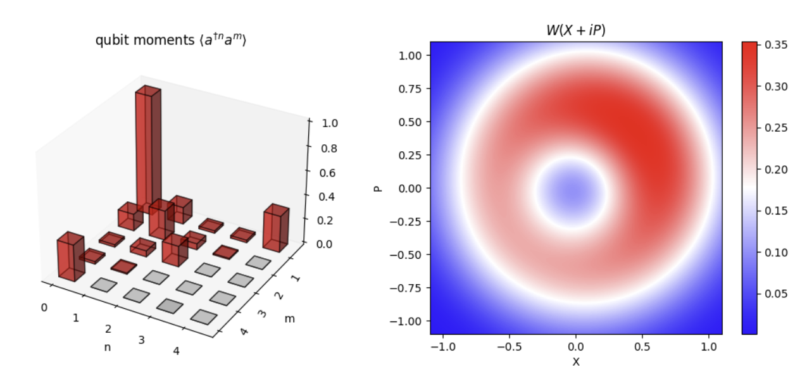

## ✨ Photon State Tomography
In chapter 3 of the PhD thesis [eth-6886-02] by Christopher Eichler, submitted to ETH Zurich, discusses photon state tomography and its technical details.
I read the theis and in this repo I provides tools to implement the claculations of photon state tomography based his method, in python.
> [!NOTE]  
> It only contains the part that after we obtain the qubit emmision data.
> For kits about measurement, please consule other resources.
> See [overview](#📝-overview-of-photon-state-tomography) at the end of this file to see what this repo have provided.


---

## 📂 File Descriptions
- **`supportkit.py`**: A utility kit for studying and debugging. Not required for the core implementation.
- **`utility.py`**: Contains helper functions for the implementation of tomography.
- **`example.ipynb`**: Provides example use cases for the tools.

---

## 📜 Usage
Directly download the code to use it:
```
git clone https://github.com/ElenBOT/tomography.git
```

See `example.iypnb` for examples, also, the docsting for each function provides an easy example for itself.
> [!CAUTION] 
> Some older version python might encounter the syantax error for type annotation of "`|`" symbol.
> Delete type annotation if encountered.
---

## 📝 Overview of photon state tomography

In short, photon state tomography reconstructs quantum states using statistical data from qubit emissions $S = a + h^\dagger$, while $a$ is qubit mode and $h$ is noise. 
With methods to account for noise contributions, it can determining qubit moments $\langle a^{\dagger n} a^m \rangle$, the Wigner function $W(\alpha)$, and the density matrix $\rho$.

1️⃣ **Temporal Mode Matching**:
   - For emmsion profile, apply a filter in time domain and matching it temporality, to obtain measured result.
   - Single-shot measurement data is obtained as $S = X + iP = a + h^\dagger$, where $a$ represents the qubit mode and $h$ represents noise.

 2️⃣ **Histogram Construction**: 
   - Multiple single-shot measurements are taken to construct a distribution histogram.
   - Two cases are measured:
     - Driven qubit state $D_S(\alpha)$
     - Reference (undriven) state $D_h(\alpha)$

 3️⃣ **Computing Single Moments**: 
   - The moments of the driven state are calculated as
     $\langle S^{\dagger n} S^m \rangle = \int_S S^{*n} S^m D_S(S)$
   - The noise moments of the reference state are given by
     $\langle h^n h^{\dagger m} \rangle = \langle S^{\dagger n} S^m \rangle_{D_h}$

 4️⃣ **Extracting Qubit Moments**: 
   - Using the expansion formula
     $\langle S^{\dagger n} S^m \rangle_{\rho_a} =
     \sum_{i,j=0}^{n,m} \binom{m}{j} \binom{n}{i} 
     \langle a^{\dagger i} a^j \rangle
     \langle h^{n-i} h^{\dagger(m-j)} \rangle$
   - The moments $\langle a^{\dagger n} a^m \rangle$ are extracted accordingly.

 5️⃣ **Constructing the Wigner Function**
   - The Wigner function is computed using
   - $W(\alpha) = \sum_{n,m} \int d^2\lambda \frac{ \langle (a^\dagger)^n a^m \rangle (-\lambda^*)^m \lambda^n} {\pi^2 n m} \exp(-\frac{1}{2} |\lambda|^2 + \alpha \lambda^\ast - \alpha^\ast \lambda)$

 6️⃣ **Reconstructing the Density Matrix**:
   - The density matrix $\rho$ is obtained using Maximum Likelihood Estimation (MLE), maximizing the likelihood function
     $\mathcal{L} = - \sum_{n,m} \frac{1}{\delta_{n,m}^2} \left| \langle (a^\dagger)^n a^m \rangle - \text{Tr}(\rho_a (a^\dagger)^n a^m) \right|^2$
     
For details, see docting, the reference theis, and `example.ipynb`.
